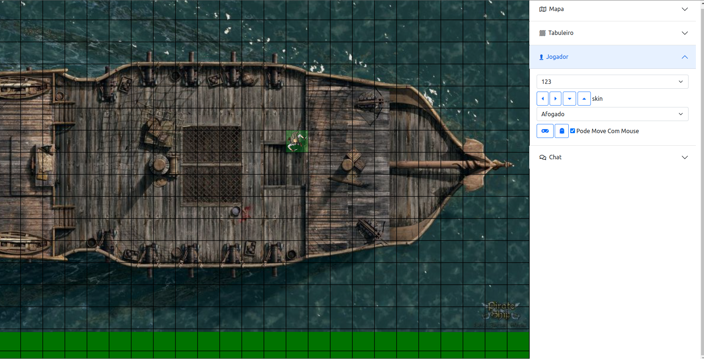

# Grid digital para RPG
Projeto para mesas de RPG presenciais. Ele conta com uma tela de gerenciamento do grid e uma tela onde os jogadores podem ver as mudanças no grid.



## Como Usar

Primeiro Clone o projeto, acesse a pasta e instale as dependencias:

```
git clone https://github.com/joulgs/grid-digital.git

cd grid-digital

composer install
```

Inicie o servidor:

```
php ./server.php
```


Agora voce pode abrir o **painel** (index.html) e o **grid** (mapa.html), tudo que o mestre fazer no painel será replicado no grid.

### Objetivos
- ✔ Renderizar uma imagem de mapa no fundo;
- ✔ Mover o mapa para todos os 4 lados;
- ✔ Girar o mapa;
- ✔ Adicionar e remover jogadores;
- ✔ Renderizar o Token do jogador;
- ✔ Mover o Token do jogador por teclado;
- ✔ Mover o Token do Jogador com o mouse;
- Girar Token do jogador;
- Mostrar Movimentos possiveis do Jogador;
- Mostrar Campo de Visão do Jogador;
- Marcar quadrado como obstaculo/barreira;
- Uma Tela de rolagem de dados animada;
- Opção para trocar a cor do grid;
- Opção para mudar a opacidade do grid;
- Opção para trocar para grid hexagonal;
- Opção para adicionar mobs;

### Ideias
- Um Mapa de Campanha ( Paise ) e varios mapas de batalha
- No Mapa de Campanha voce pode colocar marcadores que dão acesso aos mapas de Batalha, OU mapas de cidades
- Nos Mapas de Cidades Voce pode colocar os marcadores que dão acesso a mapas de casas ou dungeons etc....
- Gerenciar HP dos mobs no mapa?
- Criador de masmorra;
- Criador de mapas simples com tileset;
- QRCode para players sincronizarem seus personagens com a partida;

#### Teste com Aurora 22-03-22
- Adicionar muitos mobs é ruim;
- Ajustar a posição do mapa é lento e tedioso, slide talvez;
- Colocar um Nome tambem é uma etapa tediosa, usuarios resolveriam isso;
- Os tokens ficar pequenos diante do square;
- Alguns mapas já tem gride, opção ocultar gride;
- O ajuste da grid é muito grande, talvez usar um slide sejá uma opção melhor;
- Rolagem de dados faz falta;
- uma rolagem rapida talvez seja melhor, exemplo: aparece duas caixas com os resultados de cada personagem destacando o maior e o menor, pensando na ideia de baixo;
- pensei em transformar em um projeto para Iniciar crianças no RPG, quem sabe?

###### Algumas fontes que inspirarão o projeto:
 - [Noções gerais de canvas](https://diveintohtml5.com.br/canvas.html)
 - [Colocando imagem em canvas](https://stackoverflow.com/questions/14012768/html5-canvas-background-image)
 - [Desenhando com canvas](https://developer.mozilla.org/pt-BR/docs/Web/API/Canvas_API/Tutorial/Drawing_shapes)
 - [Artes de totens no DevianArt](https://www.deviantart.com/ktechnicolour/art/Kian-Roll-20-Token-545614962)
 - [Pegando X e Y com mouse](https://pt.stackoverflow.com/questions/300375/como-obter-x-e-y-do-clique-em-canvas)
 - [Teste: Comunicaçao entre paginas usando LocalStorage](https://pt.stackoverflow.com/questions/83866/comunica%C3%A7%C3%A3o-entre-p%C3%A1ginas-via-javascript)
 - [Noções de WebStorage](https://developer.mozilla.org/pt-BR/docs/Web/API/Web_Storage_API/Using_the_Web_Storage_API)
 - [Video Sobre WebSocket](https://www.youtube.com/watch?v=zDfM0KQ5V8o)
 - [Aplicações em tempo real com WebSocket](https://www.treinaweb.com.br/blog/aplicacoes-em-tempo-real-com-php-usando-websockets/)
